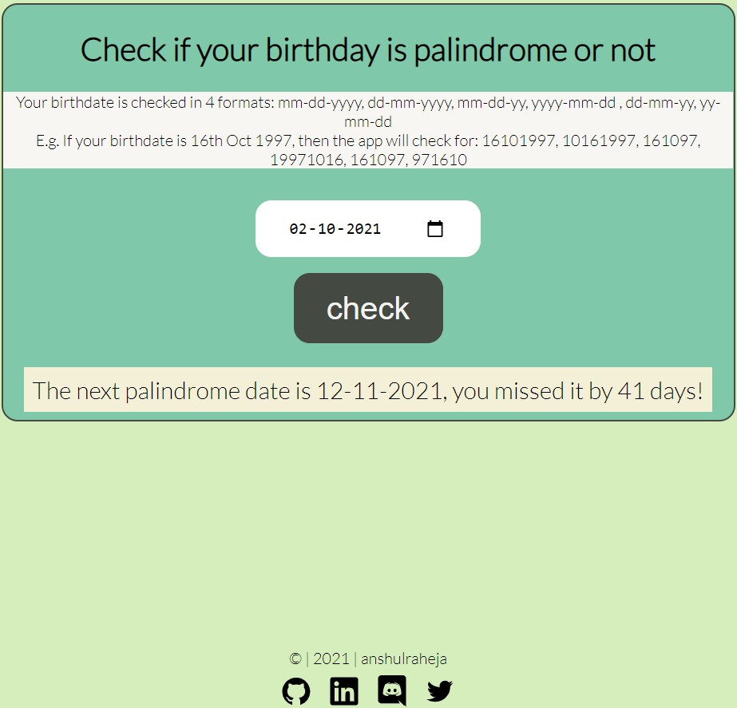

# Palindrome Birthday

### Description

###### (levelZero_markThirteen)

The app checks if your birthday is a palindrome or not. It checks 6 date formats - ddmmyyyy, mmddyyyy, yyyymmdd, ddmmyy, mmddyy, yymmd



### My learnings

- date and string manipulation

### Tech Stack

React, CSS

# Installation

```bash
git clone https://github.com/anshulraheja/levelZero_markThirteen.git
npm install
```

CodeSandBox [Link](https://codesandbox.io/s/github/anshulraheja/levelZero_markThirteen)
